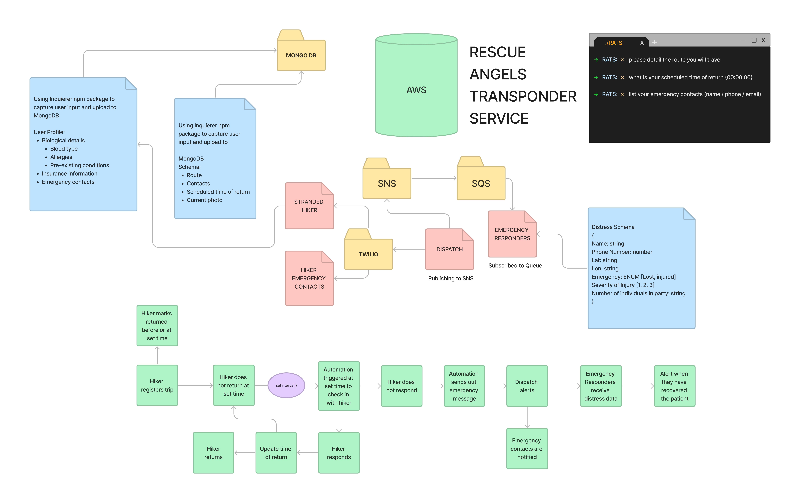

# Rescue Angels Transponder Service

## Links and Resources

[Software Requirement](https://docs.google.com/document/d/1cHOilueQXYlvPstEeojwL--eA107kw1CbXhWKxxdcxE/edit?usp=sharing)

[User Stories](https://docs.google.com/document/d/1X0NDqdkVc_YO6PaRRn52b1z8fr0FGywHuXuEbsS6ZJ8/edit?usp=sharing)

### Requirements

#### Feature Tasks

- SNS Topic: Dispatch which will receive all emergency notifications from RATS service

- SQS Queue: packages which will contain all emergency requests from dispatch, in order of severity / urgency.
  - Subscribe this queue to the dispatch topic so all requests are ordered

- SQS Queue (Standard) for each dispatch (named for the dispatch) which will contain all emergency notifications from the first responders

### Documentation

#### AWS Services used

- SNS
  - SNS created with a standard topic that will send notifications as they are received.
- SQS
  - SQS subscribed to SNS topic and will stage order notifications as they are received from the SNS topic

#### Application setup:

- Create an AWS account and create a new SNS topic and SQS application using the AWS console.
- Clone repo to your local system
- with the repo open in your editor of choice, run:
npm init -y
- install dependencies

```{
    "aws-sdk": "^2.1232.0",
    "chance": "^1.1.8",
    "sqs-consumer": "^5.7.0",
    "sqs-producer": "^2.1.0"
  }
  ```

When a local repo is established and all dependencies are installed, open two terminal instances and navigate to

```./vendor```

and

```./driver```

- Use the command node vendor.js while inside of the ./vendor directory to create an order and send a payload to the driverSNS topic.

- Use the command node driver.js while inside of the ./driver directory to consume SQS messages as they are sent to the SQS.

As an order is received by the vendor, the driver will acknowledge that an order has been picked up. The Driver will then send a message when the order has been delivered. The driver will produce a message to the SQS with delivery confirmation. The vendor will then consume the delivery confirmation and report the order id that has been delivered.

A 20 second interval between new orders has been set for the vendor and a 10 second interval between consuming SQS messages has been set for the driver to accommodate potential delays in SNS publishing and SQS consuming.


